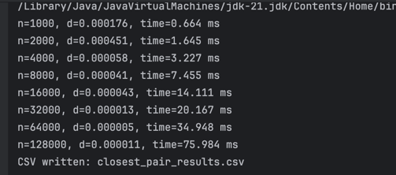
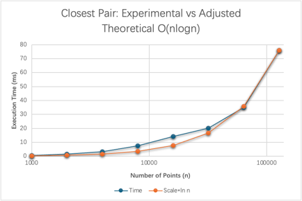

# CS6212 Project 2 — Closest Pair of Points (Java)
This program measures the runtime of the divide & conquer closest-pair algorithm and checks it against the expected Θ(n log n) growth.
### How to run
#### build
javac -d target src/ClosestpairPoints.java
#### run
java -Xms1g -Xmx1g -cp target/<your-jar>.jar ClosestpairPoints 1000 128000 7 results/closest_pair_results.csv

### You’ll get output

### What it does
#### Implements the textbook D&C closest-pair algorithm:
    First,one-time sort by x and y (reused in recursion)
    Second,linear, stable partition of Py at each level
    Third,“strip” check with ≤ 7 neighbors per point
    Last,compare by distance squared (sqrt only once at the end)
For several input sizes n (doubling schedule), it measures runtime and prints/records it.

To compare with theory, it plots the measured times next to a scaled scale⋅nlogn curve, where k is chosen to align magnitudes.

### Figure 1. Experimental runtime compared with scaled nlogn

### Files
    src/ClosestPairMini.java     // main program (D&C + simple experiment driver)
    results/closest_pair_results.csv  // sample output (optional)
    pom.xml                      // (optional) if you prefer Maven packaging
    README.md

